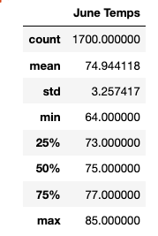
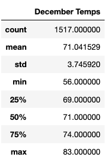
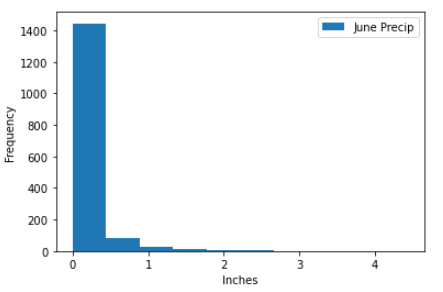
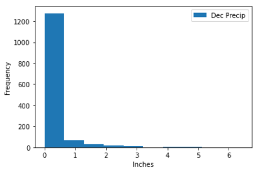

# surfs_up

# Overview:
This analysis provides W. Avy temperature trends in Oahu, specifically for June and December. This will give him a better idea if his ice cream shop is sustainable year-round.

# Results:
The following images show the statistical summary of temperatures for June and December in Oahu.

   

In comparing the two months, the following observations should be highlighted:
* The minimum temperature recorded for Oahu in December is 56 degrees, which is 8 degrees cooler than the minimum in June.
* Of the recorded temperatures, 25% of the time in December the temperature is below 69 degrees. However, in June it is 73 degrees.
* December has 183 fewer observations than for June.

# Summary:

Overall, the difference between the two months is not significant. December does have cooler temperatures, as expected, but they are sustainable being on average over 71 degrees.

To further evaluate the two months, the following charts show the frequency of precipitation. These two months are nearly identical regarding precipitation. December in Oahu should be sustainable for an ice cream shop.

  
